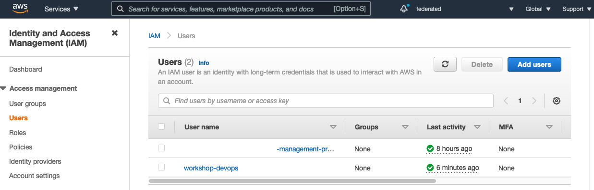
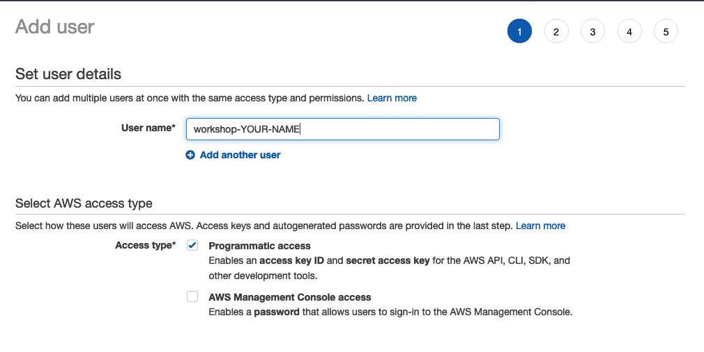
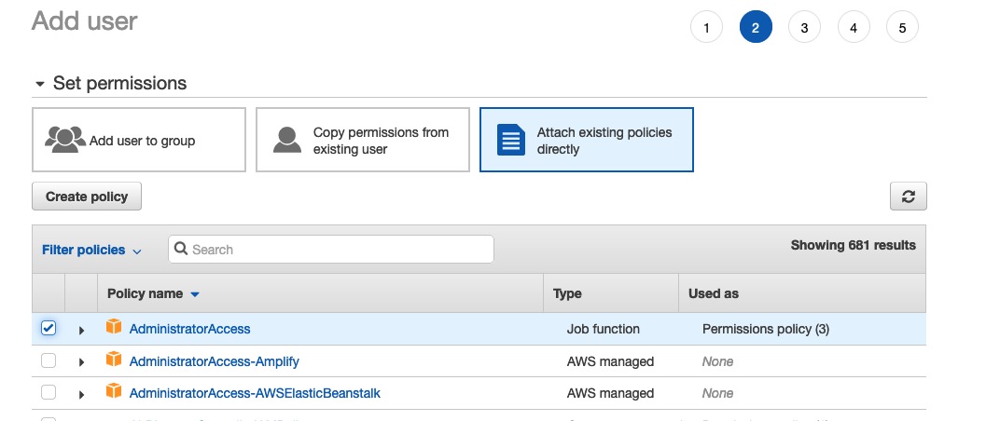
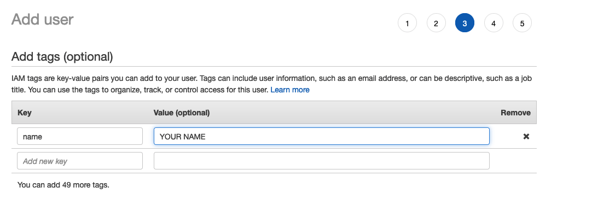
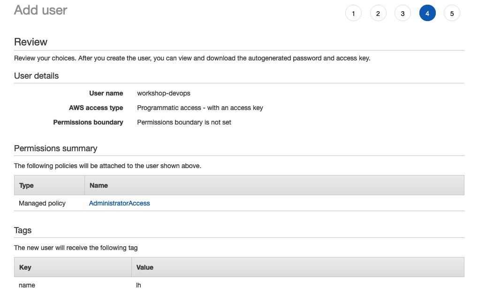
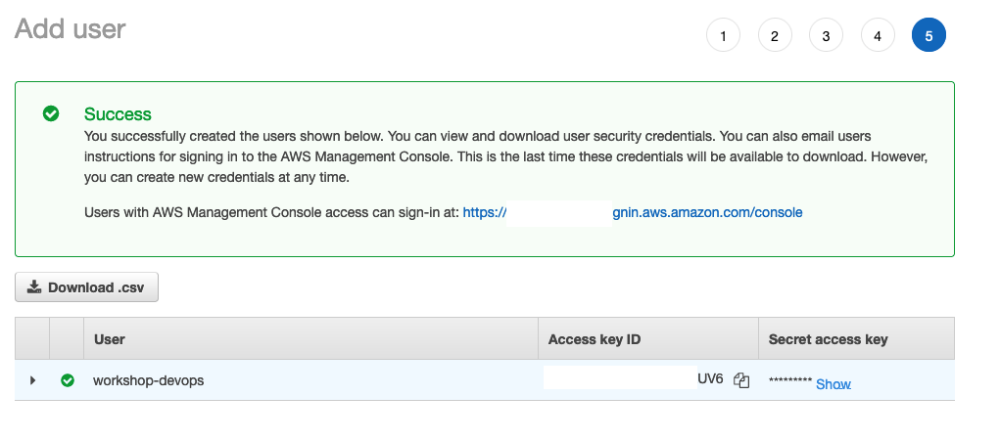

## AWS User configuration

### Step 1 Create IAM User

### Step 2 Set User details

Add your username and in **Access type** select **Programmatic access**

### Step 3 Add Administrator Access policy

You will need to select the option **Attach existing policies directly** . Take into account that this policy should not be assigned for production environments.

### Step 4 Adds tags (Optional)

### Step 5 Review values

Review the values configured and then press the button **Create User**

### Step 6 Copy Credentials

Copy the Access Key ID and Secret access key values

